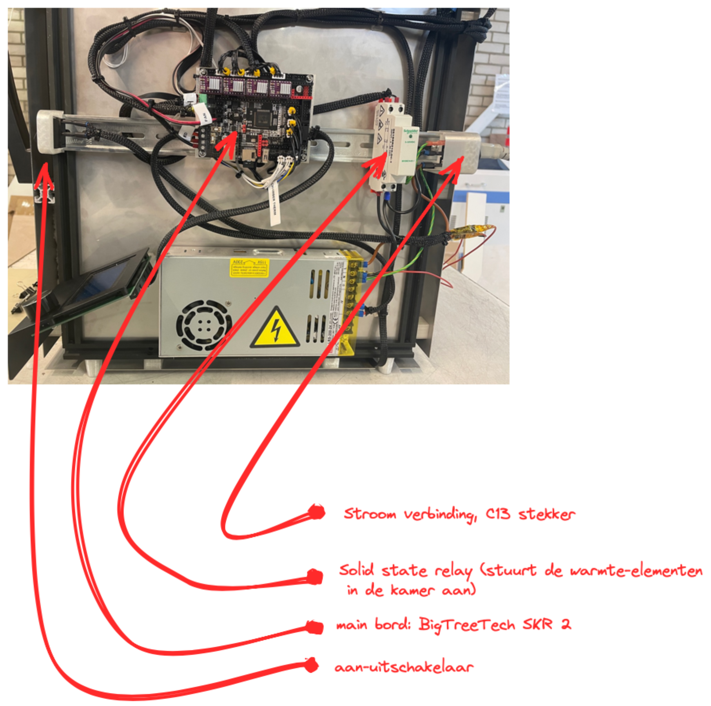

# Transfer document for the heated chamber 3D printer (solid-kinetic)

This document describes how the printer can used.

## Parts of the printer

* **main bord**: BigTreeTech SKR 2
* **Hotend**: E3D Titan Aero 1,75 mm 24V
* **Printer platform**: Creality 3D Ender-5
* **Volume** *(X,Y,Z)*: 200x200x300 mm



## What do you have to do to use the printer?

### 1. Turn on the printer

Is the printer plugged in and the power switch turned on?

### 2. Slice:

#### Prusa slicer (or other Slic3r forks)

##### install:
Install the settings files found on GitHub :
```https://github.com/lucanatorvs/solid-kinetic``` the settings files are in
the folder: ```slicer_settings/PrusaSliser``` and there are also the
installation instructions.

##### using the slicer:
[Instructions](https://www.prusa3d.com/prusaslicer/) for the slicer are on the
prusa3d website. ```https://www.prusa3d.com/prusaslicer/```

##### setting up the slicer:
The slicer has a number of settings that you can adjust. that is necessary to
get good results. But the project defaults on github are good enough to start
with.

To completely tune the printer and achieve the best results, you can use the
tool by [Teaching Tech](https://teachingtechyt.github.io/calibration.html)
```https://teachingtechyt.github.io/calibration.html```. Here is clearly
documented what you can do to calibrate the printer.

##### export gcode:

From the slicer, you can export the gcode to a micro-SD card. The printer
prints directly from the SD card. If you have trouble connecting to the card,
try turning the printer off and on, or try reformatting the SD-card to FAT32.

### 3. printing:

Print from the SD-card. Most print settings can be directly changed during the
print from the display.

### 4. Bed (leveling):

The bed leveling procedure is the same as any other 3D printer. Or use the mesh
leveling tool. The bed is coverd with PP tape, this can be scraped of and
replaced when needed.

### 5. Filament:

The printer uses 1.75 mm filament. The spool needs to be suported above the
printer and the filament needs to be fed through the hole on top of the printer
en into the E3D Titan Aero extruder-hotend.

### 6 heated chamber:

The heated chamber can either be controlled from G-CODE or from the printer directly.
The G-CODE comands are:
```
M141 S40  ; set chamber temp @ 40
M191 S40  ; wait for chamber temp @ 40
```

## furure improvements

Add a water cooled hotend-extruder. 


